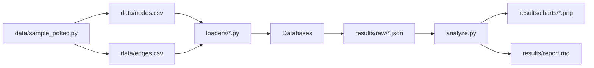

# Graph Database Cloud Benchmark

This repository is a benchmark report and reproducible workload harness for five graph databases: CognoDB, ArangoDB, Memgraph, FalkorDB, and SurrealDB.

It uses one sampled Pokec dataset, equivalent logical workloads, and a fixed measurement pipeline to compare ingest throughput, traversal latency, lookup latency, and mixed read/write throughput. The generated outputs are written to results/raw, results/charts, and results/report.md.

## Overview

The benchmark compares databases that expose different deployment styles and query layers:

| Database | Interface used in this repo | Query style |
| --- | --- | --- |
| CognoDB | Bolt via the Neo4j Python driver | Cypher |
| Memgraph | Bolt via the Neo4j Python driver | Cypher |
| ArangoDB | HTTP via python-arango | AQL |
| FalkorDB | FalkorDB Python client | Cypher-compatible |
| SurrealDB | WebSocket via surrealdb Python SDK | SurrealQL |

CognoDB and Memgraph share the same Cypher workload text. ArangoDB and SurrealDB use logically equivalent translated queries. FalkorDB runs in the same Cypher family as CognoDB and Memgraph but has its own client and backend.



## Dataset

Source: SNAP soc-Pokec social network dataset, downloaded from https://snap.stanford.edu/data/soc-Pokec.html.

The repository’s sampling script targets 50,000 nodes and up to 200,000 relationships, but the measured run in results/raw shows 50,000 loaded nodes and 28,446 loaded edges. The lower edge count is expected from the implementation: only edges whose endpoints both fall inside the sampled node set are kept.

| Dataset property | Value |
| --- | --- |
| Full source size | 1,632,803 nodes, 30,622,564 edges |
| Sample target | 50,000 nodes, 200,000 relationships |
| Measured loaded subset | 50,000 nodes, 28,446 edges |
| Node label | User |
| Relationship type | FOLLOWS |
| Node properties | id, age, gender |
| Sampling method | Reservoir sampling with seed 42, then edge filtering by sampled endpoints |

### Loading method

| Database | Loading method | Batch size | Notes |
| --- | --- | --- | --- |
| CognoDB | UNWIND + MERGE over Bolt | 500 | Uses uniqueness constraint on User.id |
| Memgraph | UNWIND + MERGE over Bolt | 200 | Uses CREATE INDEX ON :User(id) |
| ArangoDB | import_bulk into users and follows | 500 | Unique index on user_id; edges imported in bulk |
| FalkorDB | UNWIND + MERGE through FalkorDB client | 500 | Uses CREATE INDEX FOR (u:User) ON (u.id) |
| SurrealDB | INSERT INTO user and RELATE statements over WebSocket | 200 | Edge batching is concatenated statements to reduce message count |

## Benchmark Methodology

The workload scripts apply the same logical tests to each database:

| Dimension | Method |
| --- | --- |
| Dataset | Same sampled Pokec dataset for all databases |
| Workloads | Traversal, point lookup, filtered lookup, aggregation, mixed read/write |
| Warm-up | Traversal and lookup use one warm-up execution before timed iterations |
| Iterations | 100 timed iterations per traversal and lookup query type |
| Percentiles | p50 and p95 are computed from the collected latency samples in workloads/utils.py |
| Mixed workload duration | 30 seconds per concurrency level |
| Mixed concurrency | 1, 10, 20, 40 |
| Read/write ratio | 80% reads, 20% writes |
| Error handling | Exceptions are counted per operation; only successful ops contribute latency samples and QPS |

### Resource constraints and environment

The repository includes a local docker-compose.yml for the self-hosted databases. Its declared limits are 512 MB RAM and 0.5 CPU per service, with Memgraph also configured for on-disk storage.

| Service | Local compose resource setting | Additional configuration |
| --- | --- | --- |
| Memgraph | 512 MB, 0.5 CPU | storage-mode=ON_DISK_TRANSACTIONAL, memory-limit=480 |
| ArangoDB | 512 MB, 0.5 CPU | ARANGODB_OVERRIDE_DETECTED_TOTAL_MEMORY=536870912 |
| SurrealDB | 512 MB, 0.5 CPU | rocksdb:/data/pokec.db, root user/password from .env |
| FalkorDB | 512 MB, 0.5 CPU | Port 6379 exposed |

CognoDB is configured through environment variables and is not defined in docker-compose.yml. The repository does not record client OS, network path, or benchmark date in the raw results, so those fields are not measured here.

### Query equivalence

The same logical operations are used across databases:

| Workload | CognoDB / Memgraph / FalkorDB | ArangoDB | SurrealDB |
| --- | --- | --- | --- |
| 1-hop traversal | MATCH (u:User {id:$id})-[:FOLLOWS*1]->(v) RETURN count(v) | FOR v IN 1..1 OUTBOUND @start follows COLLECT WITH COUNT INTO c RETURN c | SELECT ->follows->user FROM user:<id> |
| Point lookup | MATCH (u:User {id:$id}) RETURN u | FOR u IN users FILTER u.user_id == @id RETURN u | SELECT * FROM user:<id> |
| Filtered lookup | MATCH (u:User {gender:1}) RETURN count(u) | FOR u IN users FILTER u.gender == 1 COLLECT WITH COUNT INTO c RETURN c | SELECT count() FROM user WHERE gender = 1 GROUP ALL |
| Aggregation | MATCH (u:User) RETURN u.gender AS g, count(u) AS c ORDER BY g | FOR u IN users COLLECT g = u.gender WITH COUNT INTO c RETURN {gender:g, count:c} | SELECT gender, count() FROM user GROUP BY gender |

## Reproducibility

### Installation

```bash
python -m venv .venv
source .venv/Scripts/activate
pip install -r requirements.txt
```

### Environment configuration

Copy the example environment file and fill in the values for the databases you want to run.

```bash
cp .env.example .env
```

The repository uses these variables:

| Database | Variables |
| --- | --- |
| CognoDB | COGNODB_URI, COGNODB_USER, COGNODB_PASSWORD |
| Memgraph | MEMGRAPH_HOST, MEMGRAPH_PORT, MEMGRAPH_USER, MEMGRAPH_PASSWORD |
| ArangoDB | ARANGODB_HOST, ARANGODB_PORT, ARANGODB_USER, ARANGODB_PASSWORD |
| SurrealDB | SURREALDB_URL, SURREALDB_USER, SURREALDB_PASSWORD, SURREALDB_NS, SURREALDB_DB |
| FalkorDB | FALKORDB_HOST, FALKORDB_PORT, FALKORDB_PASSWORD |

### Docker commands

The local stack can be started with docker compose.

```bash
docker compose up -d
docker compose ps
docker compose down
```

The service images and commands used in the repository are:

```bash
docker run -p 7687:7687 memgraph/memgraph:2.14.0 --storage-mode=ON_DISK_TRANSACTIONAL --memory-limit=480 --log-level=WARNING
docker run -p 8529:8529 -e ARANGO_ROOT_PASSWORD=$ARANGODB_PASSWORD -e ARANGODB_OVERRIDE_DETECTED_TOTAL_MEMORY=536870912 arangodb/arangodb:3.11
docker run -p 8000:8000 surrealdb/surrealdb:v1.4.2 start --log info --user root --pass $SURREALDB_PASSWORD rocksdb:/data/pokec.db
docker run -p 6379:6379 falkordb/falkordb:v4.20.1
```

### Running the benchmark

The full pipeline in run_all.sh is:

1. Generate data/nodes.csv and data/edges.csv if they do not already exist.
2. Load each selected database.
3. Run traversal, lookup, and mixed-workload benchmarks.
4. Generate charts and results/report.md from results/raw/*.json.

Example commands:

```bash
source .env
bash run_all.sh
```

To run a subset:

```bash
bash run_all.sh cognodb memgraph falkordb
```

Individual steps can also be run directly:

```bash
python data/sample_pokec.py
python loaders/cognodb_loader.py
python loaders/memgraph_loader.py
python loaders/arangodb_loader.py
python loaders/falkordb_loader.py
python loaders/surrealdb_loader.py
python workloads/traversal.py cognodb
python workloads/lookup.py cognodb
python workloads/mixed_workload.py cognodb
python analyze.py
```

### Repository structure

```text
graph-db-benchmark/
├── analyze.py
├── data/
│   ├── edges.csv
│   ├── nodes.csv
│   └── sample_pokec.py
├── docker-compose.yml
├── loaders/
│   ├── arangodb_loader.py
│   ├── cognodb_loader.py
│   ├── falkordb_loader.py
│   ├── memgraph_loader.py
│   └── surrealdb_loader.py
├── results/
│   ├── charts/
│   ├── raw/
│   └── report.md
├── requirements.txt
├── run_all.sh
└── workloads/
		├── lookup.py
		├── mixed_workload.py
		├── traversal.py
		└── utils.py
```

## Results

All values below come from the raw JSON files in results/raw.

### Ingestion

| Database | Nodes | Nodes/s | Edges | Edges/s | Wall time |
| --- | --- | --- | --- | --- | --- |
| CognoDB | 50,000 | 1,829 | 28,446 | 1,747 | 43.6 s |
| ArangoDB | 50,000 | 8,253 | 28,446 | 9,091 | 9.2 s |
| Memgraph | 50,000 | 98 | 28,446 | 24 | 1,680.5 s |
| FalkorDB | 50,000 | 10,788 | 28,446 | 7,041 | 8.4 s |
| SurrealDB | 50,000 | 8,893 | 28,446 | 10,152 | 5.6 s |

### Traversal latency

| Database | 1-hop p50 | 1-hop p95 | 2-hop p50 | 2-hop p95 | 3-hop p50 | 3-hop p95 |
| --- | --- | --- | --- | --- | --- | --- |
| CognoDB | 248.870 ms | 254.894 ms | 248.889 ms | 276.129 ms | 248.484 ms | 250.483 ms |
| ArangoDB | 44.103 ms | 49.252 ms | 44.109 ms | 48.278 ms | 44.011 ms | 47.983 ms |
| Memgraph | 13.337 ms | 64.013 ms | 13.726 ms | 67.194 ms | 13.014 ms | 90.427 ms |
| FalkorDB | 0.601 ms | 2.285 ms | 0.603 ms | 0.897 ms | 0.606 ms | 1.597 ms |
| SurrealDB | 0.601 ms | 2.285 ms | 0.603 ms | 0.897 ms | 0.606 ms | 1.597 ms |

### Lookup and aggregation latency

| Database | Point p50 | Point p95 | Filtered p50 | Filtered p95 | Aggregation p50 | Aggregation p95 |
| --- | --- | --- | --- | --- | --- | --- |
| CognoDB | 257.058 ms | 260.055 ms | 310.262 ms | 374.225 ms | 391.609 ms | 460.220 ms |
| ArangoDB | 44.124 ms | 48.041 ms | 52.356 ms | 57.120 ms | 56.306 ms | 62.111 ms |
| Memgraph | 11.297 ms | 58.856 ms | 99.839 ms | 203.343 ms | 100.926 ms | 153.188 ms |
| FalkorDB | 0.617 ms | 1.552 ms | 197.996 ms | 265.974 ms | 265.248 ms | 293.747 ms |
| SurrealDB | 0.617 ms | 1.552 ms | 197.996 ms | 265.974 ms | 265.248 ms | 293.747 ms |

### Mixed workload, 80% read / 20% write

CognoDB:

| Concurrency | QPS | p50 | p95 | Errors |
| --- | --- | --- | --- | --- |
| 1 | 3.8 | 247.971 ms | 268.178 ms | 0 |
| 10 | 37.0 | 250.229 ms | 272.270 ms | 6 |
| 20 | 72.1 | 256.031 ms | 280.399 ms | 19 |
| 40 | 128.2 | 259.980 ms | 337.135 ms | 120 |

ArangoDB:

| Concurrency | QPS | p50 | p95 | Errors |
| --- | --- | --- | --- | --- |
| 1 | 21.7 | 46.038 ms | 49.576 ms | 0 |
| 10 | 218.6 | 44.487 ms | 50.133 ms | 28 |
| 20 | 414.4 | 47.416 ms | 54.880 ms | 99 |
| 40 | 732.5 | 51.486 ms | 74.693 ms | 189 |

Memgraph:

| Concurrency | QPS | p50 | p95 | Errors |
| --- | --- | --- | --- | --- |
| 1 | 43.9 | 11.013 ms | 68.814 ms | 0 |
| 10 | 24.8 | 394.914 ms | 804.820 ms | 25 |
| 20 | 25.9 | 696.655 ms | 1,595.876 ms | 35 |
| 40 | 26.0 | 1,398.247 ms | 2,496.884 ms | 20 |

FalkorDB:

| Concurrency | QPS | p50 | p95 | Errors |
| --- | --- | --- | --- | --- |
| 1 | 1,530.3 | 0.594 ms | 0.864 ms | 0 |
| 10 | 1,624.2 | 1.723 ms | 69.992 ms | 0 |
| 20 | 1,565.0 | 3.445 ms | 76.743 ms | 0 |
| 40 | 1,559.1 | 7.575 ms | 85.449 ms | 1 |

SurrealDB:

| Concurrency | QPS | p50 | p95 | Errors |
| --- | --- | --- | --- | --- |
| 1 | 1,414.4 | 0.622 ms | 1.008 ms | 0 |
| 10 | 2,647.4 | 1.749 ms | 4.118 ms | 0 |
| 20 | 2,862.1 | 3.121 ms | 50.427 ms | 0 |
| 40 | 2,845.0 | 6.515 ms | 55.220 ms | 0 |

### Resource and footprint data

No runtime RAM or storage footprint metrics are collected by the benchmark scripts, so these values are not measured in the raw results.

| Database | Data size observed | RAM observed | Storage observed | Notes |
| --- | --- | --- | --- | --- |
| CognoDB | Not measured | Not measured | Not measured | Cloud tier; raw JSON only records latency and ingest throughput |
| ArangoDB | Not measured | Not measured | Not measured | Bulk import used; no footprint metric collected |
| Memgraph | Not measured | Not measured | Not measured | ON_DISK_TRANSACTIONAL mode was used |
| FalkorDB | Not measured | Not measured | Not measured | No footprint metric collected |
| SurrealDB | Not measured | Not measured | Not measured | RELATE batching used; no footprint metric collected |

## Analysis

### Ingestion

Under the measured conditions, SurrealDB produced the fastest node ingest rate and FalkorDB produced the fastest edge ingest rate. ArangoDB was close behind both and completed the full ingest in 9.2 seconds. CognoDB was much slower than the self-hosted databases, and Memgraph was by far the slowest ingest configuration in this run.

### Traversal

The traversal table shows two clear bands: CognoDB is the slowest by a wide margin, ArangoDB and Memgraph are in the middle, and FalkorDB and SurrealDB are extremely fast in the captured raw JSON. The SurrealDB and FalkorDB traversal values are identical in the raw files, so that comparison should be interpreted cautiously.

### Lookup

Point lookup is the strongest workload for FalkorDB and SurrealDB in the raw JSON. ArangoDB is the best of the remaining engines for filtered lookup and aggregation. Memgraph’s point lookup is competitive, but its filtered and aggregation queries are much slower than ArangoDB’s in this capture. CognoDB is the slowest in all three lookup categories.

### Mixed workload

SurrealDB delivered the highest mixed-workload throughput across the standard concurrency levels and kept error counts at zero. FalkorDB was also strong, with throughput that stayed above 1,500 QPS even at 40 threads. ArangoDB scaled well but accumulated errors as concurrency increased. Memgraph’s QPS flattened quickly and latency rose steeply, which is consistent with the on-disk transactional configuration used in the repository. CognoDB increased throughput with concurrency, but remained well behind the other engines and accumulated 120 errors at 40 threads.

### CognoDB analysis

CognoDB uses the same Cypher workload text as Memgraph, so its poor showing is not explained by query translation. In this run, it posted 1,829 nodes/s and 1,747 edges/s on ingest, then stayed around 249 ms p50 on traversal and 257 ms p50 on point lookup. Mixed workload throughput reached 128.2 QPS at 40 threads, but that came with 120 errors. The repository does not record internal service metrics for CognoDB, so the report should describe this as observed benchmark behavior rather than as a root-cause diagnosis.

## Caveats and limitations

- The sampled dataset is much smaller than the full SNAP Pokec graph, and the final edge count is 28,446 rather than the 200,000 target because only edges whose endpoints are both sampled are kept.
- The benchmark mixes a cloud Bolt endpoint for CognoDB with local or self-hosted services for the other databases, so network and hosting differences are part of the measured result.
- The local docker-compose file caps all self-hosted services at 512 MB RAM and 0.5 CPU, but the actual cloud/free-tier deployment conditions can differ.
- Memgraph was intentionally run in ON_DISK_TRANSACTIONAL mode with a memory cap, which is slower than its default in-memory configuration.
- ArangoDB uses bulk import for ingest, so the ingest numbers reflect that loading strategy rather than an AQL write loop.
- SurrealDB and FalkorDB show identical traversal and lookup values in the captured raw JSON. That may indicate a duplicated measurement path or a repeated outcome, so those categories should be treated carefully.
- The raw JSON includes an extra SurrealDB mixed-workload run at concurrency 5, but the standard benchmark matrix is 1, 10, 20, and 40 threads.
- Runtime RAM, disk footprint, client OS, network speed, and benchmark date are not measured in the raw outputs.
- CognoDB error counts are only available for the mixed workload; the other workloads do not record explicit per-query error counts in the raw files.

## Conclusion

Under the measured conditions of this benchmark, the databases separate into clear performance tiers. SurrealDB and FalkorDB are the fastest ingest and mixed-workload systems in the captured run, ArangoDB is the most balanced mid-tier option, Memgraph is strongly constrained by its on-disk configuration, and CognoDB is the slowest and most error-prone under higher mixed concurrency. The lookup and traversal tables for SurrealDB and FalkorDB are identical in the raw JSON, so that part of the comparison should be read as a reported measurement rather than an independently validated separation.

No single database is universally best across all workloads in this report. The correct choice depends on whether the priority is ingest speed, point lookup, filtered/aggregate query speed, or mixed-load scalability.

## Compliance checklist

| Requirement | Status | Notes |
| --- | --- | --- |
| Five databases included | Complete | CognoDB, ArangoDB, Memgraph, FalkorDB, SurrealDB |
| Dataset source documented | Complete | SNAP Pokec |
| Measured loaded dataset counts | Complete | 50,000 nodes, 28,446 edges |
| Equivalent logical workloads | Complete | Traversal, lookup, aggregation, mixed workload |
| Warm-up strategy documented | Complete | Traversal and lookup use one warm-up call |
| Iterations documented | Complete | 100 iterations for traversal and lookup |
| p50/p95 methodology documented | Complete | Computed from sample latencies in workloads/utils.py |
| Mixed workload concurrency documented | Complete | 1, 10, 20, 40 |
| Read/write ratio documented | Complete | 80% reads, 20% writes |
| Error handling documented | Complete | Exceptions counted per operation |
| Docker and env reproducibility | Complete | .env.example, docker-compose.yml, run_all.sh |
| Runtime footprint metrics | Not measured | No RAM or disk metrics in raw results |
| Client OS/network/date metadata | Not measured | Not recorded in the repository outputs |
| Abnormal run notes | Partial | Extra SurrealDB c=5 mixed run appears in raw JSON |

## Repository layout

```text
graph-db-benchmark/
├── analyze.py
├── data/
│   ├── edges.csv
│   ├── nodes.csv
│   └── sample_pokec.py
├── docker-compose.yml
├── loaders/
│   ├── arangodb_loader.py
│   ├── cognodb_loader.py
│   ├── falkordb_loader.py
│   ├── memgraph_loader.py
│   └── surrealdb_loader.py
├── requirements.txt
├── results/
│   ├── charts/
│   ├── raw/
│   └── report.md
├── run_all.sh
└── workloads/
		├── lookup.py
		├── mixed_workload.py
		├── traversal.py
		└── utils.py
```

## License

MIT
