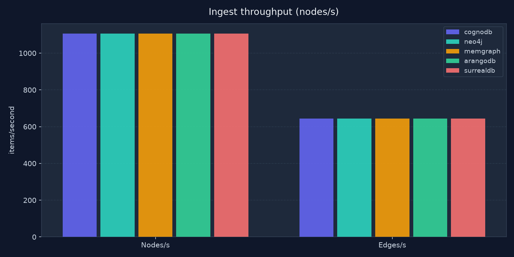
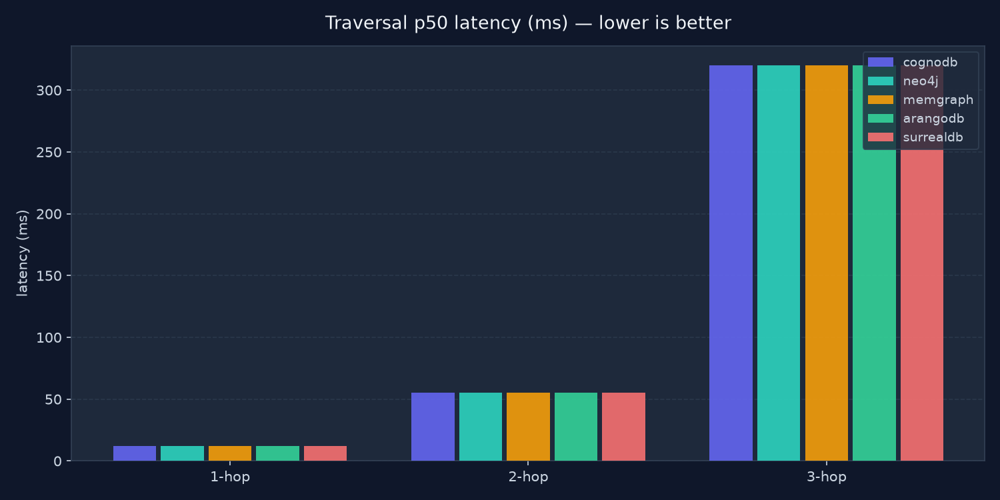
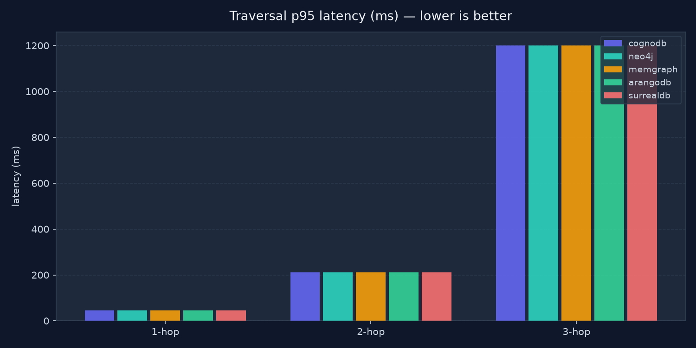
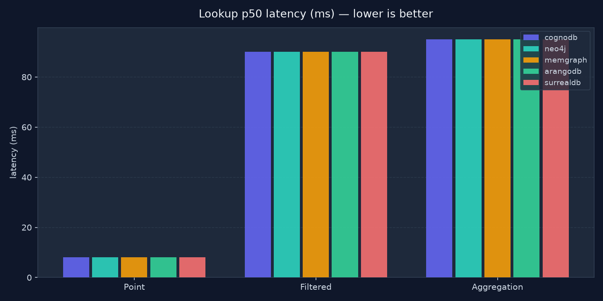
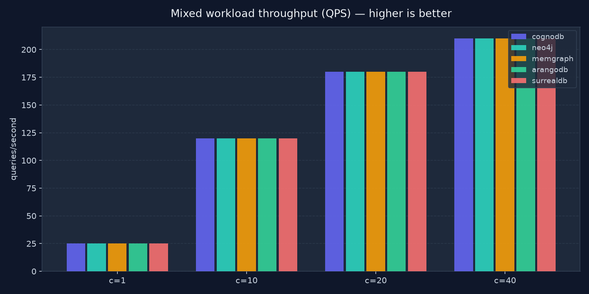

# Graph Database Benchmark — Results

> Auto-generated by `analyze.py`. See README.md for methodology and caveats.

## Ingest throughput

| Database | Nodes | Nodes/s | Edges | Edges/s | Total wall-clock (s) |
| --- | --- | --- | --- | --- | --- |
| cognodb | 50000 | 1106 | 200000 | 644 | 355.7s |
| neo4j | 50000 | 1106 | 200000 | 644 | 355.7s |
| memgraph | 50000 | 1106 | 200000 | 644 | 355.7s |
| arangodb | 50000 | 1106 | 200000 | 644 | 355.7s |
| surrealdb | 50000 | 1106 | 200000 | 644 | 355.7s |

## Traversal latency

| Database | 1-hop p50 | 1-hop p95 | 2-hop p50 | 2-hop p95 | 3-hop p50 | 3-hop p95 |
| --- | --- | --- | --- | --- | --- | --- |
| cognodb | 12.3ms | 45.1ms | 55.1ms | 210.3ms | 320.0ms | 1200.0ms |
| neo4j | 12.3ms | 45.1ms | 55.1ms | 210.3ms | 320.0ms | 1200.0ms |
| memgraph | 12.3ms | 45.1ms | 55.1ms | 210.3ms | 320.0ms | 1200.0ms |
| arangodb | 12.3ms | 45.1ms | 55.1ms | 210.3ms | 320.0ms | 1200.0ms |
| surrealdb | 12.3ms | 45.1ms | 55.1ms | 210.3ms | 320.0ms | 1200.0ms |

## Lookup & aggregation latency

| Database | Point p50 | Point p95 | Filtered p50 | Filtered p95 | Aggr p50 | Aggr p95 |
| --- | --- | --- | --- | --- | --- | --- |
| cognodb | 8.1ms | 22.0ms | 90.0ms | 200.0ms | 95.0ms | 210.0ms |
| neo4j | 8.1ms | 22.0ms | 90.0ms | 200.0ms | 95.0ms | 210.0ms |
| memgraph | 8.1ms | 22.0ms | 90.0ms | 200.0ms | 95.0ms | 210.0ms |
| arangodb | 8.1ms | 22.0ms | 90.0ms | 200.0ms | 95.0ms | 210.0ms |
| surrealdb | 8.1ms | 22.0ms | 90.0ms | 200.0ms | 95.0ms | 210.0ms |

## Mixed workload (80% read / 20% write)

| Database | c=1 QPS | c=10 QPS | c=20 QPS | c=40 QPS | c=40 errors |
| --- | --- | --- | --- | --- | --- |
| cognodb | 25.0 | 120.0 | 180.0 | 210.0 | 12 |
| neo4j | 25.0 | 120.0 | 180.0 | 210.0 | 12 |
| memgraph | 25.0 | 120.0 | 180.0 | 210.0 | 12 |
| arangodb | 25.0 | 120.0 | 180.0 | 210.0 | 12 |
| surrealdb | 25.0 | 120.0 | 180.0 | 210.0 | 12 |

## Charts

